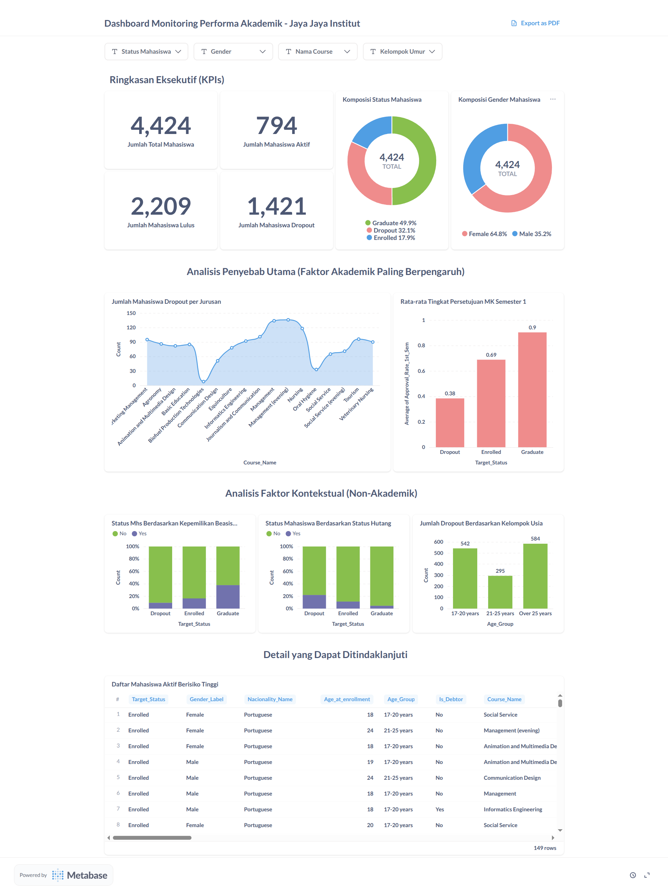
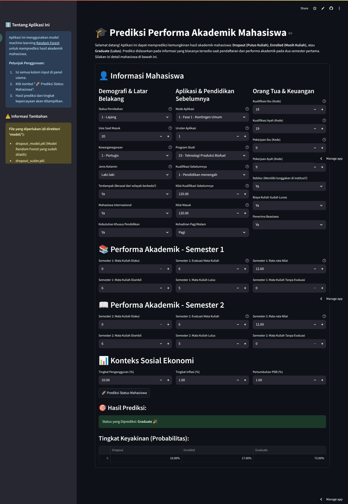

# Proyek Akhir: Menyelesaikan Permasalahan Institusi Pendidikan

## Business Understanding
Jaya Jaya Institut adalah sebuah institusi pendidikan tinggi yang telah berdiri sejak tahun 2000 dan memiliki reputasi yang sangat baik dalam mencetak lulusan berkualitas. Meskipun demikian, institut menghadapi tantangan signifikan terkait tingginya jumlah mahasiswa yang tidak menyelesaikan pendidikannya atau dropout. Tingginya angka dropout ini tidak hanya mempengaruhi reputasi institusi, tetapi juga keberlanjutan operasionalnya. Oleh karena itu, diperlukan sebuah solusi berbasis data untuk mengatasi masalah ini.

### Permasalahan Bisnis
Permasalahan utama yang dihadapi Jaya Jaya Institut adalah **kurangnya sistem untuk mendeteksi secara dini mahasiswa yang berisiko dropout**. Tanpa deteksi proaktif, pihak institut kesulitan untuk memberikan bimbingan atau intervensi yang tepat waktu, sehingga banyak mahasiswa yang terlanjur berhenti di tengah jalan. Proyek ini bertujuan untuk menyelesaikan masalah tersebut dengan membangun sebuah sistem pendukung keputusan yang dapat mengidentifikasi mahasiswa berisiko.

### Cakupan Proyek
Proyek ini mencakup seluruh siklus hidup data science untuk menghasilkan solusi yang fungsional, dengan rincian sebagai berikut:
1. **Analisis Data Eksploratif (EDA):** Memahami faktor-faktor utama yang berkorelasi dengan status dropout mahasiswa dari dataset yang disediakan.
2. **Pengembangan Model Machine Learning:** Membangun dan melatih model klasifikasi untuk memprediksi status akademik mahasiswa (Dropout, Graduate, Enrolled).
3. **Pembuatan Business Dashboard:** Merancang dan membangun dashboard interaktif menggunakan Metabase untuk memonitor tren dan performa akademik mahasiswa secara visual.
4. **Pengembangan Prototipe Aplikasi:** Membuat aplikasi web sederhana menggunakan Streamlit sebagai prototipe yang dapat digunakan untuk melakukan prediksi pada data mahasiswa individual.
5. **Penyusunan Rekomendasi:** Memberikan rekomendasi strategis yang dapat ditindaklanjuti oleh manajemen berdasarkan temuan dari data.

### Persiapan
- **Sumber data:** Dataset performa mahasiswa yang disediakan oleh Dicoding, dapat diakses melalui tautan [ini](https://raw.githubusercontent.com/dicodingacademy/dicoding_dataset/refs/heads/main/students_performance/data.csv).
- **Setup environment:** Untuk menjalankan proyek ini, Anda perlu menyiapkan environment Python. Pastikan semua library yang dibutuhkan telah terpasang dengan menjalankan perintah berikut:
    ```bash
    pip install -r requirements.txt
    ```

## Business Dashboard
Sebuah business dashboard telah dikembangkan menggunakan Metabase untuk memberikan wawasan visual kepada manajemen Jaya Jaya Institut. Dashboard ini dirancang dengan alur cerita yang logis, mulai dari KPI tingkat atas hingga analisis penyebab utama.

Dashboard ini memungkinkan pengguna untuk:
- Memantau metrik kunci seperti total mahasiswa dan tingkat dropout secara real-time.
- Mengidentifikasi jurusan dengan tingkat dropout tertinggi.
- Menganalisis korelasi antara performa semester satu dengan status akhir mahasiswa.
- Mengeksplorasi pengaruh faktor non-akademik seperti status beasiswa dan tunggakan UKT.

Berikut adalah tampilan dari dashboard yang telah dibuat:


## Menjalankan Sistem Machine Learning
Sebuah prototipe aplikasi berbasis web telah dibuat menggunakan Streamlit untuk mempermudah penggunaan model machine learning yang telah dikembangkan. Aplikasi ini memungkinkan pengguna (seperti dosen wali atau bagian akademik) untuk memasukkan data seorang mahasiswa dan mendapatkan prediksi status akademiknya beserta tingkat kepercayaan model.

**Cara Menjalankan Prototipe Secara Lokal:**
1. Pastikan environment Anda sudah aktif (lihat bagian Persiapan).
2. Pastikan semua file model (.pkl) berada di dalam direktori model/.
3. Buka terminal atau command prompt, navigasikan ke direktori utama proyek.
4. Jalankan perintah berikut:
    ```bash
    streamlit run app.py
    ```
5. Aplikasi akan terbuka secara otomatis di browser Anda.

Berikut adalah tampilan dari prototipe yang telah dibuat:


**Akses Prototipe Online:**
- [Link Menuju Aplikasi Streamlit](https://jaya-jaya-institut.streamlit.app/)

## Conclusion
Proyek ini berhasil mengembangkan dua artefak utama yang saling melengkapi untuk mengatasi masalah dropout di Jaya Jaya Institut: sebuah dashboard untuk monitoring strategis dan sebuah aplikasi ML untuk prediksi individual.

1. **Faktor Prediktif Utama:** Analisis dan pemodelan menunjukkan bahwa performa akademik di semester pertama (terutama rasio mata kuliah yang disetujui terhadap yang diambil) adalah prediktor paling signifikan terhadap kemungkinan seorang mahasiswa untuk dropout.
2. **Area Masalah Teridentifikasi:** Dashboard secara visual mengonfirmasi bahwa beberapa jurusan spesifik memiliki tingkat dropout yang jauh lebih tinggi dibandingkan yang lain, menandakan perlunya investigasi lebih mendalam pada level departemen.
3. **Solusi Komprehensif:** Kombinasi dashboard Metabase dan aplikasi Streamlit memberikan solusi 360 derajat, memungkinkan manajemen untuk melihat tren makro dan memungkinkan staf akademik untuk melakukan intervensi pada level mikro.

### Rekomendasi Action Items
Berdasarkan kesimpulan di atas, berikut adalah beberapa rekomendasi tindakan yang dapat segera diimplementasikan oleh Jaya Jaya Institut:

1. Implementasi Sistem Peringatan Dini (Early Warning System):
    - **Aksi:** Secara otomatis mengidentifikasi dan menandai mahasiswa yang tingkat persetujuan mata kuliahnya di semester 1 di bawah 50%.
    - **Tindak Lanjut:** Mahasiswa yang ditandai wajib mengikuti sesi konseling bersama dosen pembimbing akademik untuk membahas kesulitan yang dihadapi dan merancang rencana studi yang lebih realistis.
2. Program Intervensi Khusus per Jurusan:
    - **Aksi:** Bentuk tim khusus untuk melakukan evaluasi mendalam pada 2-3 jurusan dengan tingkat dropout tertinggi yang teridentifikasi di dashboard.
    - **Tindak Lanjut:** Lakukan survei atau wawancara dengan mahasiswa dari jurusan tersebut untuk memahami akar masalah, apakah terkait kurikulum, metode pengajaran, atau kurangnya sumber daya pendukung.
3. Sosialisasi Bantuan Keuangan Proaktif:
    - **Aksi:** Gunakan data status pembayaran UKT untuk mengidentifikasi mahasiswa yang mulai menunggak.
    - **Tindak Lanjut:** Bagian kemahasiswaan secara proaktif menghubungi mahasiswa tersebut untuk menginformasikan tentang opsi bantuan keuangan, beasiswa, atau skema pembayaran fleksibel yang tersedia, sebelum mereka memutuskan untuk berhenti karena alasan finansial.
